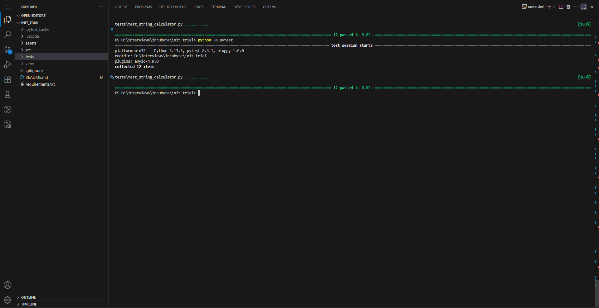
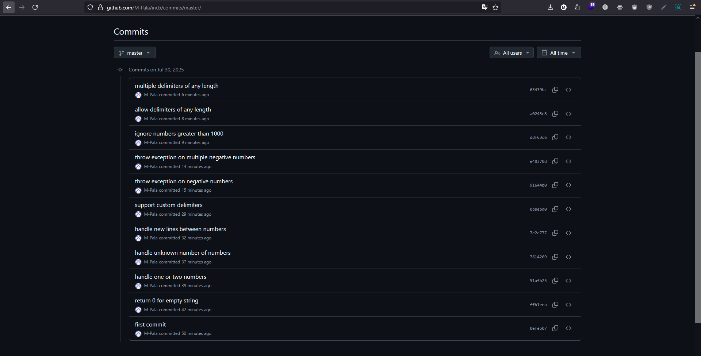

# String Calculator - TDD Kata

This repository contains a Python implementation of the String Calculator kata using Test Driven Development (TDD) and Pytest.

## Features

- Handles empty strings, single, and multiple numbers
- Supports newlines and custom delimiters
- Throws on negative numbers with a detailed message
- Ignores numbers > 1000
- Supports multi-character and multiple delimiters

## Run Tests

```bash
pip install -r requirements.txt
python -m pytest
```
## Screenshots

- All tests passing

    

- Commit history

    